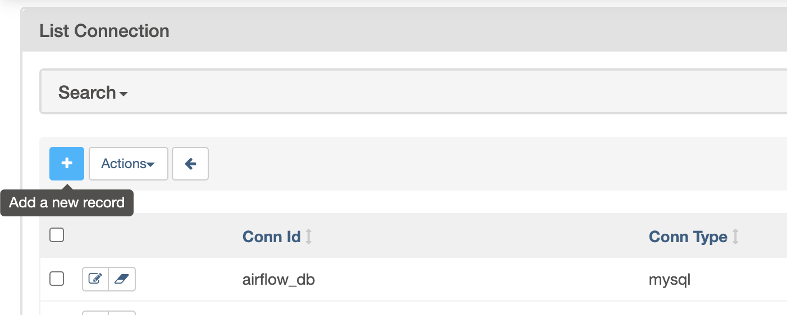

# Advanced Airflow Concepts

### Airflow Hooks:

Hooks are an interface to interact with external systems. Hooks handle the connection and interaction to specific instances of these systems, and expose consistent methods to interact with them.

Some of the built-in hooks are,

- HiveHook
- mysql
- mssql
- oracle
- http
- Slack
---

#### Custom Hook:

extend `BaseHook` class and override `get_conn`, `get_records`, `run` methods as needed

---

### Connections:

Connections store information about external data sources and credentials to access them. 

The idea here is that scripts use references to database instances (conn_id) instead of hard-coding hostname, logins and passwords when using operators or hooks.

```python
create_pet_table = PostgresOperator(
    task_id="create_pet_table",
    postgres_conn_id="postgres_default",
    sql="sql/pet_schema.sql",
)
```

---

#### Airflow connections via Airflow UI

##### List all the connections:


---

##### Create a new connection:


---

#### Airflow connections via environment variable:

Airflow will consider any environment variable with the prefix `AIRFLOW_CONN`.

E.g:  to set `S3_DEFAULT` connection, you can set the environment variable `AIRFLOW_CONN_S3_DEFAULT`

Example (for a db connection):
```bash
export AIRFLOW_CONN_MY_PROD_DATABASE='{
    "conn_type": "my-conn-type",
    "login": "my-login",
    "password": "my-password",
    "host": "my-host",
    "port": 1234,
    "schema": "my-schema",
}'
```
---

### Variables:

Variables are a generic way to store and retrieve arbitrary content or settings as a simple key-value store within Airflow.It is useful to set environment variable to pass across the pipeline.


---

### Setting variables in code

Apart from UI, we can set environment variable programmatically as well, 

```python
from airflow.models import Variable
Variable.set("foo","value")
foo = Variable.get("foo")
## set json as a value
Variable.set("bar",'{ "name":"John", "age":30, "city":"New York"}') 
## deserialize json value
bar = Variable.get("bar", deserialize_json=True) 
```

---

### Macros & Templates:

Airflow leverages the power of Jinja Templating, and this can be a powerful tool to use in combination with macros. 

Macros are a way to expose objects to your templates. 
Macros reside in the `macros` namespace in your templates.

Airflow built-in macros: 

https://airflow.apache.org/code.html#macros

Airflow built-in templates variables: 

https://airflow.apache.org/code.html#default-variables

---
##### Custom airflow macros:

Step 1: define the custom macro

```python
CUSTOM_MACROS = {
  'echo': lambda id: 'echo ' + id
}
```

Step 2: configure the macro in the airflow dag definition

```python
dag = DAG(
    dag_id='example_bash_operator', default_args=args,
    schedule_interval='0 0 * * *',
    dagrun_timeout=timedelta(minutes=60),
    user_defined_macros=CUSTOM_MACROS # user defined macros added to the dag context
)
```

---

### Custom macros

Step 3: Access using jinja template variables

```python
CMD ='{{echo("joe")}}'
task = BashOperator(
        task_id='runme',
        bash_command=CMD,
        dag=dag)
```

---
### XCom:

XComs, or short for "cross-communication" are stores of key, value, and timestamps meant to communicate between tasks. 

XComs are stored in Airflow's metadata database with an associated `execution_date`, `TaskInstance`, and `DagRun`.

XComs can be “pushed” (sent) or “pulled” (received). 

When a task pushes an XCom, it makes it generally available to other tasks. Tasks can push XComs at any time by calling the`xcom_push()`method.

---

### Xcom Example

XComs are explicitly "pushed" and "pulled" to/from their storage using the `xcom_push` and `xcom_pull` methods on Task Instances. Many operators will auto-push their results into an XCom key called `return_value` if the `do_xcom_push` argument is set to `True` (as it is by default), and `@task` functions do this as well.

`xcom_pull` defaults to using this key if no key is passed to it, meaning it's possible to write code like this:

```python
 # Pulls the return_value XCOM from "pushing_task"
value = task_instance.xcom_pull(task_ids='pushing_task')
```