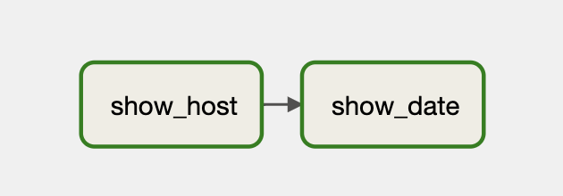

# Our First DAG

Let's create our first DAG and load it into Airflow

---

## Airflow Configuration

The DAG files are picked up from a directory defined in Airflow configuration.

The config file is found by default in `/opt/airflow/airflow.cfg `

.exercise[
    ```bash
    docker-compose exec airflow-webserver cat /opt/airflow/airflow.cfg | less
    ```
]

Can be also seen in Web UI (if `expose_config` is set to `true`)

Go to Admin->Configurations

Find the `expose_config` property.

--
```bash
 # Expose the configuration file in the web server
 expose_config = False
```

---
## Config File vs. Environment Variables

All Airflow configuration properties can be overridden by environment variables.
In the web interface the actual values can be found under "Running Configuration"

The name of the environment variable is constructed as follows:

`AIRFLOW__{SECTION}__{KEY}` (note the double underscores)

E.g for the DAG file folder:

airflow.cfg : 
```bash
[core]  #section name
dags_folder = /opt/airflow/dags #key name
```

Environment variable:

`AIRFLOW__CORE__DAGS_FOLDER`

---
## Environment Variables in Our Setup

In our lab setup some environment variables have been predefined in the docker-compose.yaml:

.exercise[
    ```bash
    cat ~/airflow-training/airflow/docker-compose.yaml | grep AIRFLOW__
    ```
]

--
```bash
AIRFLOW__WEBSERVER__EXPOSE_CONFIG: 'true'
```

---

## Loading our first DAG

In our setup the /opt/airflow/dags is mounted from ~/airflow-training/airflow/dags on our host.

.exercise[
```bash
ls ~/airflow-training/airflow/dags
``` 
]

--

Nothing here yet

---
## Let's create our first DAG!

.exercise[
```bash
cat << EOF >> ~/airflow-training/airflow/dags/myfirstdag.py
from airflow import DAG
from airflow.operators.bash import BashOperator
from airflow.utils.dates import days_ago
with DAG(
    'first',
    start_date=days_ago(0),
    description='Our first little DAG',
    tags=['first']
) as dag:
    t1 = BashOperator(
        task_id='show_date',
        bash_command='date',
    )
EOF
```
]

---

## Refreshing DAG definitions

By default Airflow will restart its workers at an interval defined by `AIRFLOW__WEBSERVER__WORKER_REFRESH_INTERVAL`

If you don't want to wait - you can restart the scheduler, worker and webserver:

```bash
docker-compose restart airflow-scheduler airflow-webserver airflow-worker
```

In about a minute - you should see the DAG appear in the 'DAGs' view of the UI.

---

## Running the DAG

On Airflow UI go to 'DAGs'.

Click on  next to the 'first' DAG definition.

Choose "Trigger DAG".

Watch the 'Runs' column of the display.

---

## Defining Task Relationships 

Let's add another task (and also check where our tasks run)

.exercise[
    Open myfirstdag.py and add the following:
```python
    t2 = BashOperator(
            task_id='show_host',
            bash_command='hostname',
        )

    t2 >> t1
```
]

Wait for the scheduler to pick it up.

(Click on DAG->Links->Code)

---

## Defining Task Relationships

Let's see how to trigger the DAG from cli.

`docker-compose exec airflow-webserver airflow dags trigger first`

```
Created <DagRun first ....
```

Wait for it to return and go to UI - DAG Runs -> Click on last manual execution:



See how `t2` got executed before `t1`

This is the result of ` t2 >> t1 ` !
